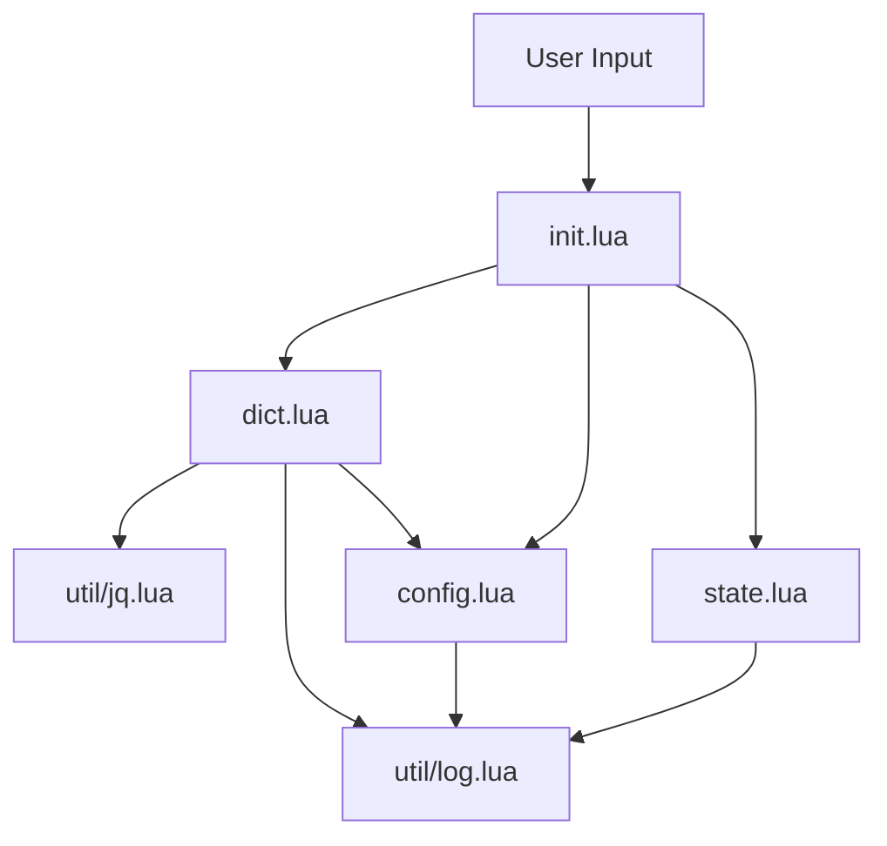

# System Patterns

## Architecture Overview
translate.nvim follows a modular architecture with clear separation of concerns:

## Core Components

### Entry Point (init.lua)
- Provides the main API for the plugin
- Handles user interactions (visual selection or current word)
- Manages the floating window display
- Sets up keymappings for window navigation

### Dictionary Handler (dict.lua)
- Core translation functionality
- Searches the dictionary file using ripgrep
- Processes and formats dictionary entries
- Uses JQ for JSON processing
- Returns formatted entries for display

### Configuration (config.lua)
- Manages plugin options with sensible defaults
- Handles user configuration
- Validates configuration values
- Constructs dictionary file path based on language setting

### State Management (state.lua)
- Implements the boilerplate pattern with local state and explicit save() function
- Provides getter/setter methods for state properties
- Ensures state persistence between plugin invocations via global variables
- Tracks floating window, selection, and buffer information

### Utilities
- **log.lua**: Provides logging functionality with different levels
- **jq.lua**: Builds JQ queries for processing dictionary JSON data

## Key Design Patterns

### Module Pattern
Each Lua file exports a table of functions and values, following the module pattern common in Lua development.

### Dependency Injection
Components receive their dependencies through `require` statements, making the code more testable and modular.

### Singleton State
The state module acts as a singleton, providing a single source of truth for the plugin's state.

### Command Pattern
The plugin exposes a user command that delegates to the appropriate handler functions.

## Data Flow

1. **User Interaction**: User triggers translation via command or keybinding
2. **Word Selection**: Plugin gets the current word or visual selection
3. **Toggle Check**: Checks if the window is already open and if the selection is unchanged
   - If both conditions are true, closes the window (toggle behavior)
   - Otherwise, proceeds with translation
4. **Dictionary Search**: Uses ripgrep to search the dictionary file
5. **Data Processing**: Processes JSON data using JQ
6. **Entry Formatting**: Formats entries for display
7. **Window Management**: 
   - If window is already open, closes it first
   - Creates a new window with the formatted entries
8. **User Navigation**: User can scroll or dismiss the window

## Technical Decisions

### External Tools
- Uses external tools (ripgrep, jq) for efficient dictionary searching and JSON processing
- Leverages Neovim's `vim.system()` for process execution

### Floating Window
- Uses Neovim's floating window API for non-disruptive display
- Configurable appearance (size, border, etc.)

### Markdown Formatting
- Formats dictionary entries as Markdown for better readability
- Sets buffer filetype to "markdown" for syntax highlighting

### Event Handling
- Uses buffer-local keymappings that only exist while the float is open
- Cleans up resources when the window is closed
